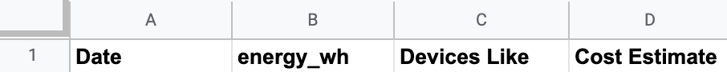
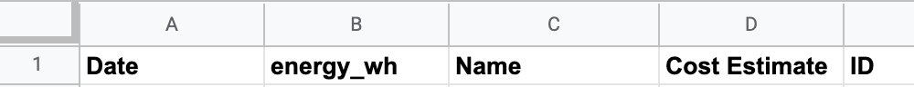

# myb-kasa-electricity-recorder

A serverless system to capture TP-Link Kasa electricity data and record it

This project contains source code and supporting files for a serverless application that you can deploy with the SAM CLI. 

The [`template.yaml`](template.yaml) is a template that defines the application's AWS resources and configurations for those resources. Pay special attention to this file for configuring the project.

If you prefer to use an integrated development environment (IDE) to build and test the application, you can use the AWS Toolkit.  
The AWS Toolkit is an open source plug-in for popular IDEs that uses the SAM CLI to build and deploy serverless applications on AWS. The AWS Toolkit also adds a simplified step-through debugging experience for Lambda function code. See the following links to get started.

* [PyCharm](https://docs.aws.amazon.com/toolkit-for-jetbrains/latest/userguide/welcome.html)
* [IntelliJ](https://docs.aws.amazon.com/toolkit-for-jetbrains/latest/userguide/welcome.html)
* [VS Code](https://docs.aws.amazon.com/toolkit-for-vscode/latest/userguide/welcome.html)
* [Visual Studio](https://docs.aws.amazon.com/toolkit-for-visual-studio/latest/user-guide/welcome.html)

## AWS SAM CLI 

The Serverless Application Model Command Line Interface (SAM CLI) is an extension of the AWS CLI that adds functionality for building and testing Lambda applications. It uses Docker to run the functions in an Amazon Linux environment that matches Lambda.

To use the SAM CLI, you need the following tools.

* SAM CLI - [Install the SAM CLI](https://docs.aws.amazon.com/serverless-application-model/latest/developerguide/serverless-sam-cli-install.html)
* [Python 3 installed](https://www.python.org/downloads/)
* Docker - [Install Docker community edition](https://hub.docker.com/search/?type=edition&offering=community)

## TP-Link Kasa

You will need a TP-Link Kasa account so that you can provide credentials. These are the same that you would use to sign in to the Kasa app - an email and password. If you don't have them, you can get user credentials for TP-Link Kasa [here](https://www.tp-link.com/us/).

## Google Sheets

This project leverages Google Sheets for long-term storage of the daily smart plug electricity usage. It uses two spreadsheets, one for aggregates each day of all plugs detected based on name pattern matching, and the other for individual plug power recordings.

The current column settings assume you have a sheet that looks like this for the aggregates:



And a sheet that looks like this for the individual plug readings:



Sheets API documentation (Python) can be found [here](https://developers.google.com/sheets/api/quickstart/python). That includes instructions on getting credentials for accessing Sheets.

A spreadsheet's ID and individual sheet ID (within a spreadsheet) can be found following the instructions [here](https://developers.google.com/sheets/api/guides/concepts). (Hint: it's in the URL! `https://docs.google.com/spreadsheets/d/spreadsheetId/edit#gid=sheetId`)

In order to use an API Key to programmatically access a spreadsheet, the easiest method I found was:
1. Create a [Google Cloud Platform (GCP) project](https://cloud.google.com/resource-manager/docs/creating-managing-projects)
1. [Enable the Google Sheets API](https://support.google.com/googleapi/answer/6158841?hl=en)
1. [Create a service account](https://cloud.google.com/iam/docs/creating-managing-service-accounts)
1. [Create an API Key for your Service Account](https://cloud.google.com/iam/docs/creating-managing-service-account-keys) - Choosing the JSON option as the final step will give you a JSON file with key data to use
1. [Share](https://support.google.com/docs/answer/2494822?co=GENIE.Platform%3DDesktop&hl=en) the spreadsheet with that service account's email

## Set up Secrets

This project utilizes a combination of in-template environment variable configuration settings, as well as referenced plaintext strings using [AWS Systems Manager](https://aws.amazon.com/systems-manager/)

To create secrets using the AWS CLI, follow the instructions [here](https://docs.aws.amazon.com/systems-manager/latest/userguide/param-create-cli.html). You will need to populate secrets based on the referenced names in the [`template.yaml`](template.yaml) and make sure to use the same region as specified in the [`samconfig.toml`](samconfig.toml).

The general syntax of the command to add a secret is:

```sh
aws ssm put-parameter \
    --name "/example/hierarchy/secret" \
    --type "String" \
    --value "ami-12345abcdeEXAMPLE"
```

You can also list all parameters stored directly in a path with:

```sh
aws ssm get-parameters-by-path --path /example/hierarchy
```

These secret paths should match the paths found in the [`template.yaml`](template.yaml) file as values for certain environment variables. An example is 

```yaml
TPLINK_KASA_USERNAME: '{{resolve:ssm:/tplink_kasa/username:1}}'
```

In this case, you would want to run the following command to store the secret with `ssm`:

```sh
aws ssm put-parameter \
    --name "/tplink_kasa/username" \
    --type "String" \
    --value "example@gmail.com"
```

## Deploy the application

Note that this project already comes with a [`samconfig.toml`](samconfig.toml) file for ease of use. With that file, you can build and deploy with the following:

```sh
sam build --use-container
sam deploy
```

The first `sam` command will build the source of the application. The second `sam` command will package and deploy the application to AWS.

To build and deploy with a walkthrough to customize changes to the config, run the following in your shell:

```sh
sam build --use-container
sam deploy --guided
```

The second `sam` command will trigger a series of prompts to customize the deployment configuration:

* **Stack Name**: The name of the stack to deploy to CloudFormation. This should be unique to your account and region, and a good starting point would be something matching the project name.
* **AWS Region**: The AWS region you want to deploy the app to.
* **Confirm changes before deploy**: If set to yes, any change sets will be shown to you before execution for manual review. If set to no, the AWS SAM CLI will automatically deploy application changes.
* **Allow SAM CLI IAM role creation**: Many AWS SAM templates, including this example, create AWS IAM roles required for the AWS Lambda function(s) included to access AWS services. By default, these are scoped down to minimum required permissions. To deploy an AWS CloudFormation stack which creates or modified IAM roles, the `CAPABILITY_IAM` value for `capabilities` must be provided. If permission isn't provided through this prompt, to deploy this example you must explicitly pass `--capabilities CAPABILITY_IAM` to the `sam deploy` command.
* **Save arguments to samconfig.toml**: If set to yes, your choices will be saved to a configuration file inside the project, so that in the future you can just re-run `sam deploy` without parameters to deploy changes to the application.

## Use the SAM CLI to build and test locally

Build the application with the `sam build --use-container` command.

```sh
sam build --use-container
```

For rebuilding small changes, it should be a lot faster to use the following command:

```sh
sam build --use-container --parallel --skip-pull-image
```

The SAM CLI installs dependencies defined in `requirements.txt` files for each function, creates a deployment package, and saves it in the `.aws-sam/build` folder.

Before invoking a function, make sure you have any necessary secrets in an `env.json` file as that will be necessary to [override any environment variables](https://docs.aws.amazon.com/serverless-application-model/latest/developerguide/serverless-sam-cli-using-invoke.html#serverless-sam-cli-using-invoke-environment-file) referencing AWS Systems Manager strings. The SAM CLI does not currently support dynamic resolution of those references running locally. An `example_env.json` is provided for you to show what it could look like for this project.

Test a single function by invoking it directly.

Run functions locally and invoke them with the `sam local invoke` command. Note the use of `--env-vars` to pull values from the file mentioned above.

```sh
sam local invoke --env-vars env.json ExampleFunction
```

Start an API locally.

```sh
sam local start-api
```

## Fetch, tail, and filter Lambda function logs

To simplify troubleshooting, SAM CLI has a command called `sam logs`. `sam logs` lets you fetch logs generated by the deployed Lambda function from the command line. In addition to printing the logs on the terminal, this command has several nifty features to help you quickly find the bug.

`NOTE`: This command works for all AWS Lambda functions; not just the ones you deploy using SAM.

```sh
sam logs -n ExampleFunction --stack-name myb-kasa-electricity-recorder --tail
```

You can find more information and examples about filtering Lambda function logs in the [SAM CLI Documentation](https://docs.aws.amazon.com/serverless-application-model/latest/developerguide/serverless-sam-cli-logging.html).

## Testing

Note that currently only local testing is supported.

Before running tests for the lambda functions, we need to host them locally. This can be done with the following command which starts by ensuring the code is built and then starts the lambda environment:

```sh
sam build --use-container --parallel --skip-pull-image
sam local start-lambda --env-vars env.json
```

Once that has been done, you can run the tests using:

```
pytest --verbose
```

Or a specific test using:
```
pytest --verbose tests/test_specific_function.py
```

## Cleanup

To delete this application after it has been deployed successfully, use the AWS CLI. Assuming you used the project name for the stack name, you can run the following:

```sh
aws cloudformation delete-stack --stack-name myb-kasa-electricity-recorder
```

## Resources

See the [AWS SAM developer guide](https://docs.aws.amazon.com/serverless-application-model/latest/developerguide/what-is-sam.html) for an introduction to SAM specification, the SAM CLI, and serverless application concepts.

Next, you can use AWS Serverless Application Repository to deploy ready to use Apps that go beyond hello world samples and learn how authors developed their applications: [AWS Serverless Application Repository main page](https://aws.amazon.com/serverless/serverlessrepo/)
